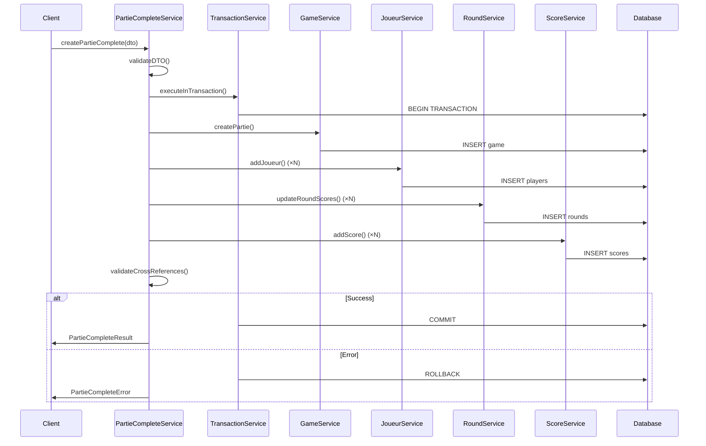

# Partie Complete Orchestration - Architecture & Workflow

## 🎯 Issue #18 - Orchestration 'Création Partie Complète'

Service d'orchestration pour création de partie complète avec coordination transactionnelle de tous les services métier.

---

## 📋 Table des Matières

1. [Vue d'ensemble](#vue-densemble)
2. [Architecture hexagonale](#architecture-hexagonale)
3. [Workflow d'orchestration](#workflow-dorchestration)
4. [API et DTOs](#api-et-dtos)
5. [Gestion transactionnelle](#gestion-transactionnelle)
6. [Gestion d'erreurs](#gestion-derreurs)
7. [Tests et validation](#tests-et-validation)
8. [Exemples d'utilisation](#exemples-dutilisation)
9. [Performance et monitoring](#performance-et-monitoring)

---

## 🔍 Vue d'ensemble

### Objectif

Créer un service d'orchestration `PartieCompleteService` qui coordonne la création d'une partie complète avec :

- Partie (via `GameService`)
- Joueurs (via `JoueurService`)
- Rounds (via `RoundService`)
- Scores détaillés (via `ScoreService`)

### Principes architecturaux

- **Architecture hexagonale** : Séparation claire des couches
- **Transaction ACID** : Rollback automatique en cas d'erreur
- **Coordination de services** : Pas de duplication de logique métier
- **Validation cross-services** : Cohérence des données entre services
- **Observabilité** : Logging et traçabilité complète

---

## 🏗️ Architecture Hexagonale

### Diagramme architectural

```
┌─────────────────────────────────────────────────────────┐
│                  PRESENTATION LAYER                     │
│                (Controllers, Routes)                    │
├─────────────────────────────────────────────────────────┤
│                 APPLICATION LAYER                       │
│  ┌───────────────────────────────────────────────────┐  │
│  │           PartieCompleteService                   │  │
│  │        (Orchestration + Coordination)            │  │
│  │                                                   │  │
│  │  ┌─────────────┐  ┌──────────────┐  ┌───────────┐│  │
│  │  │ GameService │  │JoueurService │  │ScoreService││  │
│  │  │             │  │              │  │           ││  │
│  │  │RoundService │  │              │  │           ││  │
│  │  └─────────────┘  └──────────────┘  └───────────┘│  │
│  │                                                   │  │
│  │           TransactionService                      │  │
│  └───────────────────────────────────────────────────┘  │
├─────────────────────────────────────────────────────────┤
│                    DOMAIN LAYER                         │
│     Game, Player, Round, Score Aggregates              │
│              + Specialized Errors                       │
├─────────────────────────────────────────────────────────┤
│               INFRASTRUCTURE LAYER                      │
│      Repository Adapters + Transaction Management      │
└─────────────────────────────────────────────────────────┘
```

### Séparation des responsabilités

| Couche             | Responsabilité                | Composants                             |
| ------------------ | ----------------------------- | -------------------------------------- |
| **Application**    | Orchestration et coordination | `PartieCompleteService`, DTOs          |
| **Domain**         | Règles métier et validation   | Entities, Value Objects, Domain Errors |
| **Infrastructure** | Persistance et transaction    | Repositories, `TransactionService`     |

---

## 🔄 Workflow d'Orchestration

### Séquence complète



### Étapes détaillées

1. **Validation DTO** (`CreatePartieCompleteDtoFactory`)
   - Validation structure et types
   - Validation règles métier
   - Normalisation des données

2. **Transaction START** (`TransactionService`)
   - Démarrage transaction AdonisJS
   - Configuration timeout et isolation

3. **Création Partie** (`GameService.createPartie`)
   - Validation données partie
   - Création entité Game
   - Persistance avec ID généré

4. **Création Joueurs** (`JoueurService.addJoueur`)
   - Pour chaque joueur dans le DTO
   - Validation pseudo unique
   - Gestion utilisateurs/invités

5. **Création Rounds/Scores** (`RoundService` + `ScoreService`)
   - Si rounds fournis dans DTO
   - Création séquentielle des rounds
   - Ajout scores détaillés par round

6. **Validation Cross-Services** (`PartieCompleteService`)
   - Cohérence joueurs ↔ partie
   - Cohérence rounds ↔ partie
   - Cohérence scores ↔ rounds ↔ joueurs

7. **Transaction COMMIT** (`TransactionService`)
   - Validation finale
   - Commit ou rollback automatique

---

## 📝 API et DTOs

### DTO Principal - `CreatePartieCompleteDto`

```typescript
interface CreatePartieCompleteDto {
  // Métadonnées partie
  userId: number
  gameType: string // 'MATCHED_PLAY', 'NARRATIVE', 'OPEN_PLAY'
  pointsLimit: number // 500, 1000, 1500, 2000, 3000
  mission?: string
  opponentId?: number

  // Joueurs (requis)
  players: PlayerDataDto[] // 1-4 joueurs

  // Rounds/Scores (optionnel)
  rounds?: RoundDataDto[] // 0-10 rounds

  // Autorisation
  requestingUserId: number
}
```

### DTOs Supports

```typescript
// Joueur
interface PlayerDataDto {
  pseudo: string // Unique par partie
  userId?: number | null // null = invité
}

// Round
interface RoundDataDto {
  roundNumber: number // Séquentiel à partir de 1
  playerScore: number // 0-100
  opponentScore: number // 0-100
  scores?: ScoreDataDto[] // Scores détaillés optionnels
}

// Score détaillé
interface ScoreDataDto {
  playerId: string // Index joueur "1", "2", "3"...
  scoreType: string // PRIMARY, SECONDARY, CHALLENGER...
  scoreName: string // Nom descriptif
  scoreValue: number // -10 à 15
}
```

### Résultat - `PartieCompleteResult`

```typescript
interface PartieCompleteResult {
  partieId: number
  gameId: number
  players: Array<{
    id: number
    pseudo: string
    isGuest: boolean
    userId?: number
  }>
  rounds: Array<{
    id: number
    roundNumber: number
    playerScore: number
    opponentScore: number
    isCompleted: boolean
  }>
  scores: Array<{
    id: number
    roundId: number
    playerId: number
    scoreType: string
    scoreName: string
    scoreValue: number
  }>
  summary: {
    totalPlayerScore: number
    totalOpponentScore: number
    status: string // 'PLANNED', 'COMPLETED'
    mission?: string
  }
}
```

---

## 🔒 Gestion Transactionnelle

### TransactionService

Service infrastructure pour gestion des transactions AdonisJS/Lucid :

```typescript
class TransactionService {
  async executeInTransaction<T>(
    operation: (trx: DatabaseTransactionContract) => Promise<T>,
    config?: TransactionConfig
  ): Promise<TransactionResult<T>>
}

interface TransactionConfig {
  timeout?: number // Défaut: 30000ms
  isolationLevel?: string // Défaut: 'READ_COMMITTED'
  enableLogging?: boolean // Défaut: true
}
```

### Avantages transactions

- **Atomicité** : Tout ou rien - pas de données partielles
- **Cohérence** : Validation cross-services avant commit
- **Isolation** : Pas d'interférence entre opérations concurrentes
- **Durabilité** : Données persistées de façon fiable

### Rollback automatique

En cas d'erreur à n'importe quelle étape :

1. Transaction automatiquement annulée
2. Toutes les données partielles supprimées
3. État de base de données restauré
4. Erreur contextuelle remontée

---

## ⚠️ Gestion d'Erreurs

### Hiérarchie d'erreurs spécialisées

```typescript
// Erreur de base
class PartieCompleteError extends Error

// Erreurs spécialisées
class PartieCompleteValidationError      // Validation DTO
class PartieCompleteTransactionError     // Échec transaction
class PartieCompleteCoordinationError    // Échec coordination services
class PartieCompleteAuthorizationError   // Autorisation refusée
class PartieCompleteBusinessRuleError    // Règle métier violée
class PartieCompleteTimeoutError         // Timeout dépassé
```

### Contexte d'erreur enrichi

Chaque erreur inclut :

- **Message descriptif** : Explication claire
- **Code d'erreur** : Identifiant unique
- **Contexte** : Données pertinentes (IDs, étape, durée...)
- **Erreur originale** : Cause racine si applicable

### Factory d'erreurs

```typescript
PartieCompleteErrorFactory.createValidationError(field, value, expected)
PartieCompleteErrorFactory.createTransactionError(step, originalError)
PartieCompleteErrorFactory.createCoordinationError(source, target, step, reason)
```

---

## 🧪 Tests et Validation

### Stratégie de test

| Type de test          | Objectif                   | Couverture                       |
| --------------------- | -------------------------- | -------------------------------- |
| **Tests unitaires**   | Validation DTO, erreurs    | `CreatePartieCompleteDtoFactory` |
| **Tests intégration** | Workflow complet, rollback | `PartieCompleteService`          |
| **Tests performance** | Timeout, gros volumes      | Transaction avec 1000+ entités   |

### Scénarios de test critiques

1. **Happy path complet** : Création partie + joueurs + rounds + scores
2. **Validation DTO** : Tous les cas d'erreur de validation
3. **Rollback sur échec joueur** : Pseudo en conflit
4. **Rollback sur échec round** : Round invalide
5. **Rollback sur échec score** : Score hors limites
6. **Performance** : Gros volumes dans timeout
7. **Autorisation** : Utilisateur non autorisé
8. **Edge cases** : Valeurs limites

### Commandes de test

```bash
# Tests unitaires DTO
npm test -- --grep="CreatePartieCompleteDtoFactory"

# Tests intégration orchestration
npm test -- --grep="Partie Complete Service"

# Tests complets
npm test -- --suite=integration
```

---

## 💡 Exemples d'Utilisation

### 1. Création partie simple (sans rounds)

```typescript
const partieData = {
  userId: 1,
  gameType: 'NARRATIVE',
  pointsLimit: 1500,
  mission: 'Recover the Relic',
  players: [
    { pseudo: 'Space_Marine', userId: 1 },
    { pseudo: 'Ork_Warboss', userId: null }, // Invité
  ],
  requestingUserId: 1,
}

const result = await partieCompleteService.createPartieComplete(partieData)
// État: PLANNED - prête pour ajout rounds ultérieur
```

### 2. Création partie complète (avec rounds)

```typescript
const partieCompleteData = {
  userId: 1,
  gameType: 'MATCHED_PLAY',
  pointsLimit: 2000,
  mission: 'Secure and Control',
  players: [
    { pseudo: 'Imperial_Commander', userId: 1 },
    { pseudo: 'Chaos_Lord', userId: 2 },
  ],
  rounds: [
    {
      roundNumber: 1,
      playerScore: 15,
      opponentScore: 12,
      scores: [
        {
          playerId: '1',
          scoreType: 'PRIMARY',
          scoreName: 'Control Objectives',
          scoreValue: 10,
        },
        {
          playerId: '1',
          scoreType: 'SECONDARY',
          scoreName: 'Linebreaker',
          scoreValue: 5,
        },
      ],
    },
    {
      roundNumber: 2,
      playerScore: 18,
      opponentScore: 14,
    },
  ],
  requestingUserId: 1,
}

const result = await partieCompleteService.createPartieComplete(partieCompleteData)
// État: COMPLETED - partie terminée avec scores finaux
```

### 3. Partie multi-joueurs (jusqu'à 4)

```typescript
const partieMultiData = {
  userId: 1,
  gameType: 'OPEN_PLAY',
  pointsLimit: 3000,
  players: [
    { pseudo: 'Imperial_Guard', userId: 1 },
    { pseudo: 'Space_Marines', userId: 2 },
    { pseudo: 'Chaos_Daemons', userId: null },
    { pseudo: 'Ork_Horde', userId: null },
  ],
  rounds: [
    {
      roundNumber: 1,
      playerScore: 25,
      opponentScore: 30, // Autres joueurs combinés
      scores: [
        { playerId: '1', scoreType: 'PRIMARY', scoreName: 'Objectives', scoreValue: 15 },
        { playerId: '2', scoreType: 'PRIMARY', scoreName: 'Objectives', scoreValue: 12 },
        { playerId: '3', scoreType: 'PRIMARY', scoreName: 'Objectives', scoreValue: 10 },
        { playerId: '4', scoreType: 'PRIMARY', scoreName: 'Objectives', scoreValue: 8 },
      ],
    },
  ],
  requestingUserId: 1,
}
```

### 4. Configuration avancée

```typescript
const config = {
  transaction: {
    timeout: 60000, // 1 minute
    isolationLevel: 'SERIALIZABLE',
    enableLogging: true,
  },
  validateCrossReferences: true,
  maxRetries: 3,
}

const result = await partieCompleteService.createPartieComplete(partieData, config)
```

---

## 📊 Performance et Monitoring

### Métriques de performance

| Métrique                      | Cible      | Mesure                                    |
| ----------------------------- | ---------- | ----------------------------------------- |
| **Latence création simple**   | < 500ms    | Partie + 2 joueurs                        |
| **Latence création complète** | < 2s       | Partie + 4 joueurs + 5 rounds + 20 scores |
| **Throughput**                | > 10 req/s | Créations concurrentes                    |
| **Taux de succès**            | > 99%      | Sans erreurs système                      |

### Logging et traçabilité

Chaque orchestration génère :

- **Transaction ID** unique
- **Timeline** détaillée par étape
- **Durée** de chaque opération
- **Données créées** (IDs, counts)
- **Erreurs** avec contexte complet

### Monitoring recommandé

```typescript
// Example log output
[Orchestration txn_abc123] Starting transaction
  Step 1: create_partie - SUCCESS (120ms)
  Step 2: create_players - SUCCESS (85ms)
  Step 3: create_rounds_and_scores - SUCCESS (340ms)
  Step 4: validate_cross_references - SUCCESS (15ms)
[Orchestration txn_abc123] SUCCESS in 560ms
```

---

## 🚀 Déploiement et Migration

### Intégration dans l'existant

L'orchestrateur s'intègre sans impact sur l'existant :

- **Réutilise** tous les services métier existants
- **Compatible** avec `GameService.createCompleteGame()`
- **N'ajoute** aucune dépendance externe
- **Maintient** l'architecture hexagonale

### Points d'attention

1. **Performance DB** : Index sur foreign keys pour joins rapides
2. **Connection pooling** : Gestion connexions longues en transaction
3. **Monitoring** : Alertes sur échecs de rollback
4. **Backup** : Stratégie de sauvegarde fréquente pour recovery

---

## 📚 Références

### Code source

- `app/application/services/partie_complete_service.ts` - Service principal
- `app/application/dto/create_partie_complete_dto.ts` - DTOs et validation
- `app/infrastructure/services/transaction_service.ts` - Gestion transactions
- `app/domain/errors/partie_complete_errors.ts` - Erreurs spécialisées
- `tests/integration/partie_complete_service.spec.ts` - Tests intégration

### Architecture

- **Hexagonal Architecture** : Ports & Adapters pattern
- **Domain-Driven Design** : Aggregates, Value Objects, Domain Events
- **CQRS** : Command/Query separation dans repositories
- **Saga Pattern** : Orchestration transactionnelle

### Standards du projet

- **Conventional Commits** : Format des messages de commit
- **TypeScript** : Typage strict et interfaces
- **TDD** : Tests first development
- **Clean Code** : Principes SOLID

---

_Documentation générée pour Issue #18 - Architecture hexagonale DDD avec AdonisJS 6_
