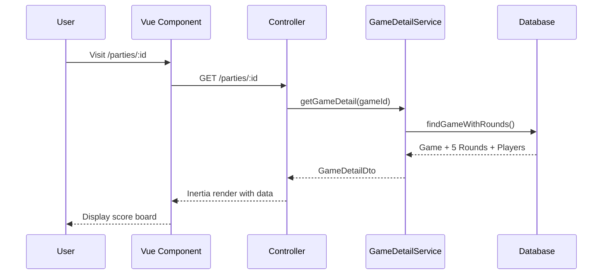
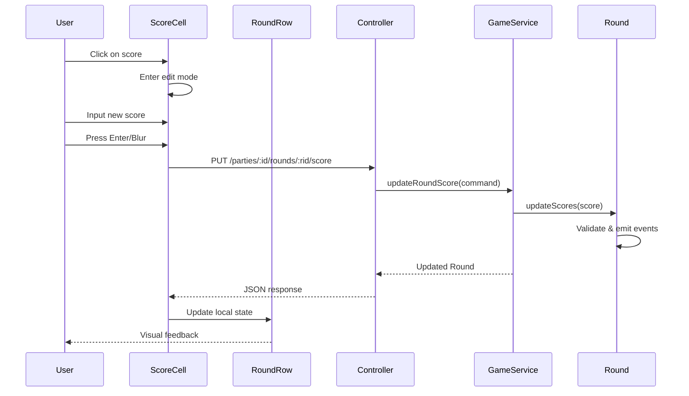

# Architecture Technique : Édition Inline des Scores

## 🏗️ Vue d'Ensemble

Cette architecture intègre la création automatique de 5 rounds avec une interface d'édition inline optimisée pour une expérience utilisateur fluide.

## 📊 Diagramme d'Architecture

```
┌─────────────────────────────────────────────────────────────────┐
│                     FRONTEND (Vue.js + Inertia)                │
├─────────────────────────────────────────────────────────────────┤
│  GameScoreBoard.vue                                             │
│  ├── ScoreSummary.vue (totaux)                                  │
│  ├── RoundRow.vue (x5) ──┐                                     │
│  │   └── ScoreCell.vue   │ (édition inline)                    │
│  └── SecondaryScores.vue │                                     │
├─────────────────────────┼─────────────────────────────────────┤
│                         │ HTTP API Calls                      │
│  CONTROLLER LAYER       ▼                                     │
├─────────────────────────────────────────────────────────────────┤
│  PartiesController                                              │
│  ├── show() ─────────────── GET /parties/:id                   │
│  └── updateRoundScore() ── PUT /parties/:id/rounds/:rid/score  │
├─────────────────────────────────────────────────────────────────┤
│  APPLICATION LAYER                                              │
├─────────────────────────────────────────────────────────────────┤
│  GameService                        GameDetailService          │
│  ├── createCompleteGame()            ├── getGameDetail()       │
│  ├── createInitialRounds()           └── getGameWithRounds()   │
│  └── updateRoundScore()                                        │
├─────────────────────────────────────────────────────────────────┤
│  DOMAIN LAYER                                                   │
├─────────────────────────────────────────────────────────────────┤
│  Game ──┬── Round.createEmpty() ──┬── RoundCreatedEvent       │
│         └── Round.updateScores()  └── RoundScoresUpdatedEvent │
├─────────────────────────────────────────────────────────────────┤
│  INFRASTRUCTURE LAYER                                           │
├─────────────────────────────────────────────────────────────────┤
│  LucidGameRepository      LucidRoundRepository                  │
│  ├── save()               ├── save()                           │
│  ├── findById()           ├── findByGameId()                   │
│  └── findWithRounds()     └── findById()                       │
└─────────────────────────────────────────────────────────────────┘
```

## 🔄 Flux de Données Détaillé

### 1. Création de Partie avec 5 Rounds

```mermaid
sequenceDiagram
    participant W as Wizard
    participant C as Controller
    participant GS as GameService
    participant R as Round Entity
    parameter DB as Database
    
    W->>C: POST /parties/create
    C->>GS: createCompleteGame(data)
    GS->>DB: save Game + Players
    
    loop 5 rounds
        GS->>R: Round.createEmpty(i)
        R->>DB: save Round
    end
    
    GS->>C: CompleteGameResult + 5 rounds
    C->>W: redirect /parties/:id
```

### 2. Affichage de la Page de Détails



### 3. Édition Inline d'un Score



## 🎯 Composants Frontend Détaillés

### GameScoreBoard.vue (Composant Racine)

```vue
<template>
  <div class="game-score-board">
    <!-- En-tête avec résumé -->
    <ScoreSummary 
      :players="players" 
      :game="game"
      class="mb-6" 
    />
    
    <!-- Grille des rounds -->
    <div class="rounds-container">
      <div class="rounds-header">
        <h3>Scores par Round</h3>
        <div class="rounds-legend">
          <span class="legend-item completed">✅ Terminé</span>
          <span class="legend-item current">🎯 En cours</span>
          <span class="legend-item pending">📋 À venir</span>
        </div>
      </div>
      
      <div class="rounds-grid">
        <RoundRow
          v-for="round in rounds"
          :key="round.id"
          :round="round"
          :players="players"
          :game-id="game.id"
          :can-edit="canEdit"
          :current-round="getCurrentRound()"
          @score-updated="handleScoreUpdate"
          @round-completed="handleRoundCompleted"
        />
      </div>
    </div>
    
    <!-- Scores secondaires -->
    <SecondaryScores 
      :players="players"
      :secondary-scores="secondaryScores"
      :can-edit="canEdit"
      class="mt-8"
    />
  </div>
</template>

<script setup lang="ts">
import { computed, ref } from 'vue'
import { router } from '@inertiajs/vue3'

interface Props {
  game: GameDetailDto
  players: PlayerDto[]
  rounds: RoundDto[]
  secondaryScores: SecondaryScoreDto[]
  canEdit: boolean
}

const props = defineProps<Props>()

// État local pour optimistic updates
const localRounds = ref([...props.rounds])

// Round en cours (premier round non complété)
const getCurrentRound = () => {
  return localRounds.value.find(r => !r.isCompleted)?.roundNumber || 6
}

// Mise à jour optimiste
const handleScoreUpdate = async (roundId: number, playerId: number, score: number) => {
  // 1. Mise à jour immédiate de l'UI
  updateLocalRound(roundId, playerId, score)
  
  try {
    // 2. Sauvegarde serveur
    await router.put(`/parties/${props.game.id}/rounds/${roundId}/score`, {
      playerId,
      score
    }, {
      preserveState: true,
      preserveScroll: true,
      only: ['rounds'] // Recharger seulement les rounds
    })
  } catch (error) {
    // 3. Rollback en cas d'erreur
    revertLocalRound(roundId, playerId)
    // Afficher notification d'erreur
  }
}

const updateLocalRound = (roundId: number, playerId: number, score: number) => {
  const round = localRounds.value.find(r => r.id === roundId)
  if (!round) return
  
  // Identifier si c'est le joueur principal ou l'adversaire
  const isMainPlayer = props.players.find(p => p.id === playerId)?.isMainPlayer
  
  if (isMainPlayer) {
    round.playerScore = score
  } else {
    round.opponentScore = score
  }
  
  // Mettre à jour le statut de complétion
  round.isCompleted = round.playerScore !== null && round.opponentScore !== null
}
</script>
```

### RoundRow.vue (Ligne de Round)

```vue
<template>
  <div :class="roundClasses">
    <div class="round-header">
      <span class="round-number">Round {{ round.roundNumber }}</span>
      <RoundStatus :round="round" :is-current="isCurrent" />
    </div>
    
    <div class="scores-row">
      <ScoreCell
        v-for="player in players"
        :key="`${round.id}-${player.id}`"
        :round="round"
        :player="player"
        :game-id="gameId"
        :editable="canEdit && (!round.isCompleted || allowEditCompleted)"
        :current="isCurrent"
        @score-updated="$emit('score-updated', $event)"
        @editing-started="handleEditingStarted"
        @editing-ended="handleEditingEnded"
      />
    </div>
  </div>
</template>

<script setup lang="ts">
import { computed, ref } from 'vue'

interface Props {
  round: RoundDto
  players: PlayerDto[]
  gameId: number
  canEdit: boolean
  currentRound: number
  allowEditCompleted?: boolean
}

const props = defineProps<Props>()
const emit = defineEmits<{
  'score-updated': [{ roundId: number; playerId: number; score: number }]
  'round-completed': [roundId: number]
}>()

const isEditing = ref(false)

const isCurrent = computed(() => 
  props.round.roundNumber === props.currentRound
)

const roundClasses = computed(() => [
  'round-row',
  {
    'round-completed': props.round.isCompleted,
    'round-current': isCurrent.value,
    'round-pending': !props.round.isCompleted && !isCurrent.value,
    'round-editing': isEditing.value
  }
])

const handleEditingStarted = () => {
  isEditing.value = true
}

const handleEditingEnded = () => {
  isEditing.value = false
}
</script>

<style scoped>
.round-row {
  @apply border-l-4 border-gray-600 bg-slate-800 rounded-lg p-4 mb-3 transition-all duration-200;
}

.round-completed {
  @apply border-green-500 bg-green-900/20;
}

.round-current {
  @apply border-orange-500 bg-orange-900/20 shadow-lg;
}

.round-pending {
  @apply border-gray-500 bg-slate-800/50;
}

.round-editing {
  @apply border-red-500 shadow-xl;
}

.scores-row {
  @apply grid grid-cols-2 gap-4 mt-3;
}
</style>
```

### ScoreCell.vue (Cellule d'Édition)

```vue
<template>
  <div :class="cellClasses" @click="startEditing">
    <!-- Mode affichage -->
    <div v-if="!isEditing" class="score-display">
      <span class="score-value">{{ displayScore }}</span>
      <EditIcon v-if="showEditIcon" class="edit-icon" />
    </div>
    
    <!-- Mode édition -->
    <div v-else class="score-edit">
      <input
        ref="scoreInput"
        v-model.number="editValue"
        :min="0"
        :max="maxScore"
        type="number"
        class="score-input"
        @blur="saveScore"
        @keyup.enter="saveScore"
        @keyup.escape="cancelEdit"
        @keyup.arrow-up="incrementScore"
        @keyup.arrow-down="decrementScore"
        @input="validateInput"
      />
      <div class="edit-actions">
        <button @click="saveScore" class="save-btn">✓</button>
        <button @click="cancelEdit" class="cancel-btn">✕</button>
      </div>
    </div>
    
    <!-- Indicateur de sauvegarde -->
    <LoadingSpinner v-if="isSaving" class="saving-indicator" />
  </div>
</template>

<script setup lang="ts">
import { computed, ref, nextTick, watch } from 'vue'

interface Props {
  round: RoundDto
  player: PlayerDto
  gameId: number
  editable: boolean
  current?: boolean
  scoreType?: 'primary' | 'secondary'
  secondaryIndex?: 1 | 2 // Pour identifier quel score secondaire (1 ou 2)
}

const props = withDefaults(defineProps<Props>(), {
  scoreType: 'primary'
})

const emit = defineEmits<{
  'score-updated': [{ roundId: number; playerId: number; score: number }]
  'editing-started': []
  'editing-ended': []
}>()

const isEditing = ref(false)
const editValue = ref(0)
const isSaving = ref(false)
const scoreInput = ref<HTMLInputElement>()

// Score maximum selon le type
const maxScore = computed(() => 
  props.scoreType === 'primary' ? 50 : 15
)

// Score actuel à afficher (défaut 0)
const currentScore = computed(() => {
  if (props.scoreType === 'secondary') {
    // Gestion des 2 scores secondaires par round
    const secondaryScores = props.round.secondaryScores?.find(s => s.playerId === props.player.id)
    return props.secondaryIndex === 1 
      ? (secondaryScores?.score1 ?? 0)
      : (secondaryScores?.score2 ?? 0)
  }
  
  return props.player.isMainPlayer 
    ? (props.round.playerScore ?? 0)
    : (props.round.opponentScore ?? 0)
})

const displayScore = computed(() => 
  currentScore.value // Toujours afficher la valeur (0 par défaut)
)

const showEditIcon = computed(() => 
  props.editable && !isEditing.value
)

const cellClasses = computed(() => [
  'score-cell',
  {
    'cell-editable': props.editable,
    'cell-editing': isEditing.value,
    'cell-current': props.current,
    'cell-completed': currentScore.value !== null,
    'cell-empty': currentScore.value === null,
    'cell-saving': isSaving.value
  }
])

// Démarrer l'édition
const startEditing = async () => {
  if (!props.editable || isEditing.value) return
  
  isEditing.value = true
  editValue.value = currentScore.value ?? 0
  emit('editing-started')
  
  await nextTick()
  scoreInput.value?.focus()
  scoreInput.value?.select()
}

// Sauvegarder le score
const saveScore = async () => {
  if (!isEditing.value || isSaving.value) return
  
  const newScore = editValue.value
  
  // Validation
  if (newScore < 0 || newScore > maxScore.value) {
    // Afficher erreur de validation
    return
  }
  
  // Pas de changement
  if (newScore === currentScore.value) {
    cancelEdit()
    return
  }
  
  isSaving.value = true
  
  try {
    emit('score-updated', {
      roundId: props.round.id,
      playerId: props.player.id,
      score: newScore
    })
    
    isEditing.value = false
    emit('editing-ended')
  } catch (error) {
    // Gestion d'erreur
  } finally {
    isSaving.value = false
  }
}

// Annuler l'édition
const cancelEdit = () => {
  isEditing.value = false
  editValue.value = currentScore.value ?? 0
  emit('editing-ended')
}

// Navigation clavier
const incrementScore = () => {
  if (editValue.value < maxScore.value) {
    editValue.value++
  }
}

const decrementScore = () => {
  if (editValue.value > 0) {
    editValue.value--
  }
}

// Validation en temps réel
const validateInput = () => {
  if (editValue.value > maxScore.value) {
    editValue.value = maxScore.value
  }
  if (editValue.value < 0) {
    editValue.value = 0
  }
}
</script>

<style scoped>
.score-cell {
  @apply relative min-h-[3rem] flex items-center justify-center
         border-2 border-transparent rounded-lg p-2
         transition-all duration-200 cursor-pointer;
}

.cell-editable:hover {
  @apply border-red-300 bg-red-900/10;
}

.cell-editing {
  @apply border-red-500 bg-red-900/20 shadow-lg;
}

.cell-current {
  @apply border-orange-300 bg-orange-900/20;
}

.cell-completed {
  @apply border-green-300 bg-green-900/10;
}

.cell-empty {
  @apply border-gray-400 bg-gray-800/50;
}

.score-display {
  @apply flex items-center gap-2;
}

.score-value {
  @apply text-xl font-bold text-white;
}

.edit-icon {
  @apply w-4 h-4 text-gray-400;
}

.score-edit {
  @apply flex items-center gap-2;
}

.score-input {
  @apply w-16 px-2 py-1 text-center font-bold
         bg-slate-700 border border-red-500 rounded
         text-white focus:outline-none focus:ring-2 focus:ring-red-300;
}

.edit-actions {
  @apply flex gap-1;
}

.save-btn, .cancel-btn {
  @apply w-6 h-6 flex items-center justify-center rounded
         text-xs font-bold transition-colors;
}

.save-btn {
  @apply bg-green-600 hover:bg-green-500 text-white;
}

.cancel-btn {
  @apply bg-red-600 hover:bg-red-500 text-white;
}

.saving-indicator {
  @apply absolute top-1 right-1;
}
</style>
```

## 🔧 Backend API Endpoints

### Routes

```typescript
// start/routes.ts

router
  .group(() => {
    // ... routes existantes ...
    
    // Nouveau endpoint pour mise à jour des scores
    router.put('/parties/:gameId/rounds/:roundId/score', [PartiesController, 'updateRoundScore'])
      .as('parties.rounds.update_score')
  })
  .middleware([middleware.auth()])
```

### Validator

```typescript
// app/validators/update_round_score_validator.ts

import vine from '@vinejs/vine'

export const updateRoundScoreValidator = vine.compile(
  vine.object({
    playerId: vine.number().positive(),
    score: vine.number().min(0).max(50),
  })
)
```

## 📊 Types TypeScript

```typescript
// inertia/pages/parties/types.ts

export interface RoundDto {
  id: number
  roundNumber: number
  playerScore: number // Défaut 0, jamais null
  opponentScore: number // Défaut 0, jamais null
  isCompleted: boolean
  gameId: number
  secondaryScores?: SecondaryScoreDto[] // 2 scores secondaires par joueur
  createdAt: string
  updatedAt: string
}

export interface SecondaryScoreDto {
  id: number
  roundId: number
  playerId: number
  score1: number // Premier score secondaire (défaut 0)
  score2: number // Deuxième score secondaire (défaut 0)
  createdAt: string
  updatedAt: string
}

export interface GameDetailDto {
  id: number
  userId: number
  gameType: string
  pointsLimit: number
  status: string
  mission?: string
  deployment?: string
  primaryScoringMethod?: string
  notes?: string
  createdAt: string
  startedAt?: string
  completedAt?: string
  isEditable: boolean
}

export interface PlayerDto {
  id: number
  pseudo: string
  userId?: number
  isMainPlayer: boolean
  totalScore: number
  gameId: number
}

export interface ScoreUpdateEvent {
  roundId: number
  playerId: number
  score: number
  scoreType: 'primary' | 'secondary'
  secondaryIndex?: 1 | 2 // Pour les scores secondaires
}
```

## 🚀 Performance & Optimisations

### 1. Optimistic Updates
- Mise à jour immédiate de l'UI
- Rollback automatique en cas d'erreur
- Feedback visuel de l'état de sauvegarde

### 2. Debouncing
- Éviter les requêtes multiples lors de la saisie rapide
- Timeout de 300ms avant sauvegarde automatique

### 3. Caching
- Cache des données de partie côté frontend
- Invalidation intelligente après mise à jour

### 4. Network Resilience
- Retry automatique en cas d'échec réseau
- Queue des modifications hors ligne
- Synchronisation à la reconnexion

## 🧪 Testing Strategy

### Frontend Tests

```typescript
// tests/vue/GameScoreBoard.spec.ts

describe('GameScoreBoard', () => {
  it('should display 5 rounds with proper states', () => {
    const wrapper = mount(GameScoreBoard, {
      props: { 
        game: mockGame,
        players: mockPlayers,
        rounds: mockRoundsWithMixed,
        canEdit: true
      }
    })
    
    expect(wrapper.findAll('.round-row')).toHaveLength(5)
    expect(wrapper.find('.round-completed')).toExist()
    expect(wrapper.find('.round-current')).toExist()
    expect(wrapper.find('.round-pending')).toExist()
  })
  
  it('should enter edit mode when clicking on editable score', async () => {
    const wrapper = mount(ScoreCell, {
      props: { round: mockRound, player: mockPlayer, editable: true }
    })
    
    await wrapper.find('.score-cell').trigger('click')
    
    expect(wrapper.find('.score-input')).toExist()
    expect(wrapper.find('input').element).toBe(document.activeElement)
  })
})
```

### Backend Tests

```typescript
// tests/functional/parties_score_update.spec.ts

test('PUT /parties/:id/rounds/:roundId/score updates round score', async ({ client }) => {
  const game = await GameFactory.createWithRounds()
  const round = game.rounds[0]
  const player = game.players[0]
  
  const response = await client
    .put(`/parties/${game.id}/rounds/${round.id}/score`)
    .json({ playerId: player.id, score: 15 })
    .loginAs(game.user)
  
  response.assertStatus(200)
  response.assertBodyContains({
    success: true,
    round: {
      id: round.id,
      playerScore: 15,
      isCompleted: false
    }
  })
})
```

Cette architecture garantit une expérience utilisateur fluide avec une édition inline intuitive, tout en maintenant une architecture hexagonale propre et des performances optimales.