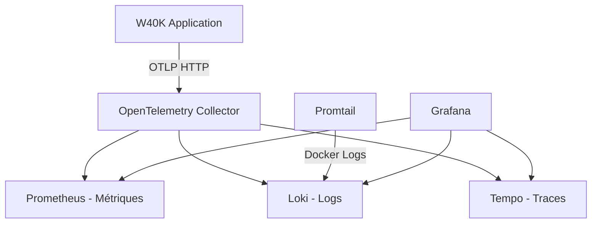
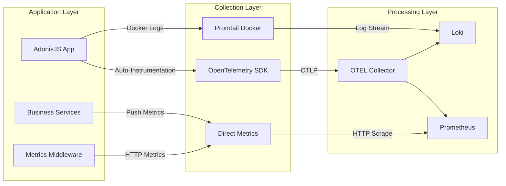

# Phase 4C - Architecture Guide - Enterprise Observability Stack

Guide architectural complet pour l'infrastructure d'observabilité W40K Scoring implémentée en Phase 4C.

## 🏗️ Vue d'Ensemble de l'Architecture

### Stack Technologique Complète

```
┌─────────────────────────────────────────────────────────────────┐
│                    OBSERVABILITY STACK                         │
├─────────────────────────────────────────────────────────────────┤
│  ┌───────────────────────────────────────────────────────────┐  │
│  │                     GRAFANA                               │  │
│  │         📊 Interface Unifiée & Dashboards               │  │
│  │              Port: 3000                                  │  │
│  └───────────────────────────────────────────────────────────┘  │
│                              │                                  │
│  ┌─────────────────┐  ┌─────────────────┐  ┌─────────────────┐  │
│  │   PROMETHEUS    │  │      LOKI       │  │     TEMPO       │  │
│  │   📈 Métriques  │  │   📝 Logs       │  │   🔍 Traces     │  │
│  │   Port: 9090    │  │   Port: 3100    │  │   Port: 3200    │  │
│  └─────────────────┘  └─────────────────┘  └─────────────────┘  │
│                              │                                  │
│  ┌───────────────────────────────────────────────────────────┐  │
│  │              OPENTELEMETRY COLLECTOR                     │  │
│  │         🔄 Point d'Entrée Central Télémétrie           │  │
│  │              Ports: 4317/4318 (OTLP)                   │  │
│  └───────────────────────────────────────────────────────────┘  │
└─────────────────────────────────────────────────────────────────┘
                              │
┌─────────────────────────────────────────────────────────────────┐
│                    W40K SCORING APPLICATION                    │
├─────────────────────────────────────────────────────────────────┤
│  ┌─────────────────┐  ┌─────────────────┐  ┌─────────────────┐  │
│  │ METRICS SERVICE │  │   OTEL SDK      │  │    PROMTAIL     │  │
│  │  📊 Business    │  │ 🚀 Auto-Instr. │  │  🐳 Docker      │  │
│  │     KPIs        │  │    Push OTLP    │  │   Log Scrape    │  │
│  └─────────────────┘  └─────────────────┘  └─────────────────┘  │
└─────────────────────────────────────────────────────────────────┘
```

## 📊 Architecture des Services Métiers

### Services d'Infrastructure Métier

```typescript
// Architecture Hexagonale - Couche Infrastructure
app/services/
├── business_metrics_service.ts      # KPIs et métriques business
├── performance_metrics_service.ts   # Métriques HTTP et performance
└── slo_metrics_service.ts          # SLO/SLI et error budget management

app/middleware/
└── metrics_middleware.ts           # Capture automatique HTTP

start/
└── metrics.ts                      # Registre global Prometheus
```

## 🎯 Objectifs de Service Level (SLO)

### SLO Définis et Implémentés

#### 1. Availability SLO
- **Objectif**: 99.9% uptime (8.7h/an downtime autorisé)
- **Mesure**: `w40k_sli_availability` 
- **Error Budget**: `w40k_error_budget_availability`
- **Alerting**: Budget burn rate monitoring

#### 2. Latency SLO  
- **Objectif**: 95% des requêtes sous 500ms
- **Mesure**: `w40k_sli_latency_p95_seconds`
- **Error Budget**: `w40k_error_budget_latency`
- **Calcul**: Histogrammes HTTP duration

#### 3. Error Rate SLO
- **Objectif**: Moins de 0.1% taux d'erreur
- **Mesure**: `w40k_sli_error_rate`
- **Error Budget**: `w40k_error_budget_error_rate`
- **Monitoring**: Codes status 4xx/5xx

#### 4. Game Creation SLO
- **Objectif**: 99% des créations sous 1 seconde
- **Mesure**: `w40k_sli_game_creation_latency_seconds`
- **Business Impact**: Performance critique utilisateur
- **Monitoring**: Endpoint `/parties` POST performance

#### 5. Security SLO
- **Objectif**: Zero incident de sécurité/mois
- **Mesure**: Compteur incidents sécuritaires
- **Error Budget**: Aucune tolérance
- **Monitoring**: Rate limiting, authentification failures

## 🔄 Architecture OpenTelemetry

### Push-Based Telemetry Strategy



### Configuration SDK Integration

```typescript
// config/telemetry.ts
const sdk = new NodeSDK({
  resource,
  instrumentations: [
    getNodeAutoInstrumentations({
      '@opentelemetry/instrumentation-pino': {
        enabled: true,
        logHook: (span, record) => {
          record['trace_id'] = span?.spanContext().traceId;
          record['span_id'] = span?.spanContext().spanId;
        },
      },
      '@opentelemetry/instrumentation-http': { enabled: true },
      '@opentelemetry/instrumentation-pg': { enabled: true },
    }),
  ],
});
```

## 📈 Métriques Exposées par Catégorie

### Business Metrics (Préfixe `w40k_`)

```prometheus
# Engagement & Growth
w40k_games_created_total            # Total parties créées
w40k_scoring_active_users_24h       # Utilisateurs actifs 24h
w40k_scoring_average_score          # Score moyen
w40k_scoring_completion_rate_percent # Taux de completion
w40k_scoring_games_by_type_total{game_type} # Parties par type
w40k_scoring_weekly_growth_percent  # Croissance hebdomadaire

# User Engagement
w40k_scoring_user_retention_7d      # Rétention 7 jours
w40k_scoring_avg_games_per_user     # Parties moyennes/utilisateur
w40k_scoring_user_total             # Total utilisateurs
```

### Performance Metrics (Préfixe `w40k_http_`)

```prometheus  
# HTTP Performance
w40k_http_requests_total{method,route,status_code}    # Compteur requêtes
w40k_http_request_duration_seconds{method,route}     # Histogramme latence
w40k_http_active_connections                         # Connexions actives

# Database Performance  
w40k_db_query_duration_seconds{operation,table}     # Performance DB
w40k_db_connections_active                           # Connexions DB actives
w40k_db_query_errors_total{operation}               # Erreurs DB
```

### SLI/SLO Metrics (Préfixe `w40k_sli_`, `w40k_slo_`)

```prometheus
# Service Level Indicators
w40k_sli_availability                    # SLI disponibilité  
w40k_sli_latency_p95_seconds            # SLI latence P95
w40k_sli_error_rate                     # SLI taux d'erreur
w40k_sli_game_creation_latency_seconds  # SLI création partie

# Service Level Objectives & Error Budget
w40k_slo_compliance{slo_type}           # Conformité SLO
w40k_error_budget_availability          # Budget erreur disponibilité
w40k_error_budget_latency              # Budget erreur latence  
w40k_error_budget_error_rate           # Budget erreur taux
```

## 🛡️ Architecture de Sécurité

### Security Monitoring Stack

```yaml
Security Layers:
  ┌─────────────────────────────────────────┐
  │           SECURITY AUDIT                │
  │          Dashboard & Alerts             │
  └─────────────────────────────────────────┘
                      │
  ┌─────────────────────────────────────────┐
  │          SECURITY METRICS               │
  │  - Rate Limiting Violations (429)       │
  │  - Authentication Failures (401)        │
  │  - Authorization Errors (403)           │
  │  - Input Validation Errors              │
  └─────────────────────────────────────────┘
                      │
  ┌─────────────────────────────────────────┐
  │        SECURITY MIDDLEWARE              │
  │  - CORS Policy Enforcement              │
  │  - CSRF Protection                      │  
  │  - Rate Limiting                        │
  │  - Input Sanitization                   │
  └─────────────────────────────────────────┘
```

## 🎨 Dashboards Enterprise-Grade

### 1. Business KPIs Dashboard (`w40k-business-overview`)

**Objectif**: Vue executif des performances business
- Total Games créées et evolution temporelle
- Utilisateurs actifs avec segmentation 24h/7d/30d
- Taux de completion et abandon des parties
- Distribution des types de jeu (Matched Play, Narrative, Open Play)
- Scores moyens et tendances de performance
- Croissance hebdomadaire et métriques de rétention

### 2. Application Performance Dashboard (`w40k-application-performance`)

**Objectif**: Monitoring technique et performance système  
- Request Rate et throughput HTTP
- Latency Distribution (P50, P95, P99) avec histogrammes
- Error Rate par endpoint et status code
- Active Connections et resource utilization
- Database performance (query duration, connection pool)
- Cache hit rates et optimisation mémoire

### 3. Security Audit Dashboard (`w40k-security-audit`)

**Objectif**: Surveillance sécuritaire et incident response
- 4xx Error Rate (authentification, autorisation)
- 5xx Error Rate (erreurs serveur critiques)  
- Rate Limiting Violations (HTTP 429)
- Failed Authentication Attempts par IP/utilisateur
- CORS Policy Violations et tentatives d'intrusion
- Security Events timeline avec corrélation logs
- Resource Usage suspicious patterns

### 4. SLI/SLO Dashboard (`w40k-slo-dashboard`)

**Objectif**: Service Level Objectives et Error Budget Management
- Availability SLI vs 99.9% target avec trend analysis
- Latency P95 SLI vs 500ms target avec alerting thresholds
- Error Rate SLI vs 0.1% target avec root cause analysis
- Game Creation Performance vs 1s target
- Error Budget Burn Rate avec projections
- SLO Compliance Status avec historical trends

## 🔧 Configuration Technique Détaillée

### Docker Compose Architecture

```yaml
# Services et leurs rôles
services:
  otel-collector:    # Point d'entrée télémétrie OTLP
    ports: [4317, 4318, 8888, 13133]
    memory: 512M
    
  prometheus:        # Métriques et alerting  
    ports: [9090]
    retention: 15d
    memory: 1G
    
  loki:             # Logs centralisés
    ports: [3100]
    retention: 168h (7d)
    memory: 512M
    
  tempo:            # Distributed tracing
    ports: [3200, 9095]  
    retention: 1h
    memory: 512M
    
  grafana:          # Interface unifiée
    ports: [3000]
    memory: 512M
    auto-provisioning: enabled
```

### Performance Budgets

```yaml
Resource Allocation:
  Total Memory: ~3GB
  Total CPU: ~4 cores
  Storage: ~50GB (with retention)
  Network: ~100Mbps sustained

Performance Targets:
  - Dashboard Load: <2s
  - Query Response: <5s  
  - Data Ingestion: <100ms p95
  - Alert Processing: <30s
```

## 🚨 Alerting Strategy

### Error Budget Burn Rate Alerting

```yaml
Fast Burn (Critical):
  condition: 2% budget consumed in 1 hour
  severity: critical
  response: immediate intervention
  
Slow Burn (Warning):  
  condition: 10% budget consumed in 6 hours
  severity: warning
  response: planned investigation
  
Budget Exhaustion (Emergency):
  condition: Error budget < 5% remaining
  severity: emergency  
  response: incident response activation
```

### Multi-Layer Alert Configuration

```yaml
Infrastructure Alerts:
  - Service Down: any component unavailable >2min
  - High Memory: >85% usage sustained >5min
  - Disk Full: >90% usage on any volume
  - Network Issues: packet loss >1%

Application Alerts:
  - High Latency: P95 >500ms for >5min
  - Error Rate: >0.1% error rate >2min  
  - Database Issues: connection failures >5/min
  - Authentication Failures: >10 failures/min from same IP

Business Alerts:
  - Game Creation Failures: >5 failures in 10min
  - User Engagement Drop: DAU decrease >20% vs baseline
  - Revenue Impact: completion rate drop >10%
```

## 📊 Data Pipeline Architecture

### Hybrid Collection Strategy



## 🔄 Maintenance et Opérations

### Backup Strategy

```bash
# Automated Backup Procedures
backup_prometheus_data() {
  docker run --rm -v prometheus-data:/data -v $PWD:/backup alpine \
    tar czf /backup/prometheus-$(date +%Y%m%d).tar.gz /data
}

backup_grafana_config() {
  docker run --rm -v grafana-data:/data -v $PWD:/backup alpine \
    tar czf /backup/grafana-config-$(date +%Y%m%d).tar.gz /data
}

# Retention Policy
find /backups -name "*.tar.gz" -mtime +30 -delete
```

### Performance Optimization

```yaml
Optimization Strategies:
  Metrics:
    - Recording rules pour queries complexes
    - Downsampling pour long-term storage  
    - Selective ingestion avec relabeling
    
  Logs:
    - Log level filtering (INFO+ en production)
    - Structured logging avec JSON format
    - Log rotation et compression automatique
    
  Traces:  
    - Probabilistic sampling (10% en production)
    - Span filtering par criticité
    - Trace context propagation optimisée
```

## 📋 Troubleshooting Runbook

Voir [TROUBLESHOOTING.md](./TROUBLESHOOTING.md) pour les procédures détaillées de résolution des incidents critiques identifiés et résolus :

- ✅ **Loki Crash Loop**: Configuration schema v11 compatibility  
- ✅ **DNS Resolution Errors**: Service networking fixes
- ✅ **Log Collection Gaps**: Hybrid push/pull strategy
- ✅ **Performance Bottlenecks**: Resource allocation optimization

## 🚀 Roadmap et Extensions

### Phase 5 - Advanced Features

```yaml
Planned Enhancements:
  Alerting:
    - Alertmanager integration
    - PagerDuty/Slack notifications
    - Incident response automation
    
  Advanced Analytics:
    - ML-based anomaly detection  
    - Predictive scaling recommendations
    - User behavior analytics
    
  Security:
    - SIEM integration
    - Threat detection rules
    - Compliance reporting
    
  Performance:
    - Multi-region deployment
    - Edge caching optimization  
    - Real user monitoring (RUM)
```

---

**Architecture validée et déployée en Phase 4C** 🎯  
**Stack prête pour production enterprise-grade** 🚀